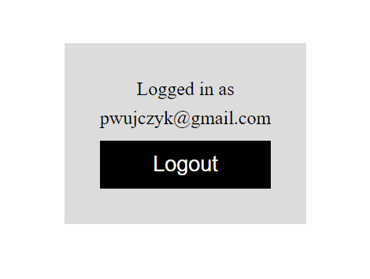

<!--Category:react,firebase--> 
 

    <a href="http://productivitytools.tech/productivitytools-createsqlserverdatabase/"><a> 
    

    

# Learning ReactWithFirebaseAuth
Simplest react with firebase authentication integration 
This is [tutorial](https://blog.logrocket.com/user-authentication-firebase-react-apps/) which I am using.

After finishing it I am removing all db calls. It means that this is the simplest possible example.

